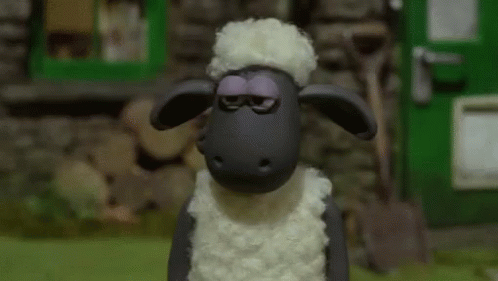

# 🙌🏻 Hi Fellas! I'm Nadia
🫠I'm undergraduate statistics student. 📌 I am interested in deepening my knowledge of machine learning. âš¡ï¸ This github was created to hold my portfolio and some notes. 
Enjoy!😉

## 🌐 Socials:
   

# 💻 Tech Stack:
    
# 📊 GitHub Stats:

# 🎧 Spotify:

  <!-- Elemen Spotify di sebelah kiri -->
  
    
    
  

 
<picture>
  <source media="(prefers-color-scheme: dark)" srcset="https://raw.githubusercontent.com/nadeyyah/nadeyyah/output/snake.svg"  />
  <source media="(prefers-color-scheme: light)" srcset="https://raw.githubusercontent.com/nadeyyah/nadeyyah/output/snake.svg"  />
  
</picture>

